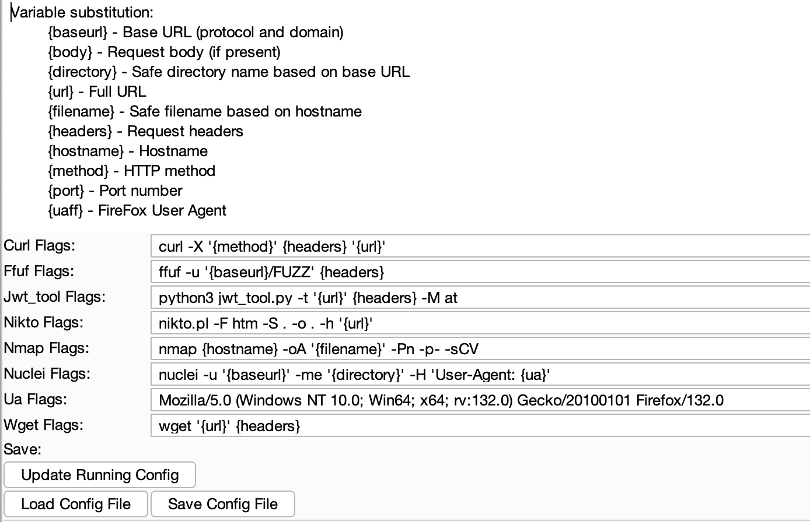

<p align="center"><h1 align="center">Burp Extension: Copy For</h1></p>

<p align="center">
  
</p>

## Purpose 
This Burp extension adds a sub-menu under the "Extensions" contextual menu (when you right-click in a request) which allows you to create a command-line to run a particular tool using the the selected HTTP request . The formatted command will then be stored in the clipboard.

Additionally, custom commands can be added via the configuration menu.


The default Copy For commands are: 
* curl
* ffuf
* jwt_tool.py
* Nikto
* Nmap
* Nuclei
* wget

## Commands
Commands are defined in the configuration panel. Each tool can be customized and saved.


Variable replacement in the commands works by parsing values from the request and replacing with the ones listed below:
```
{baseurl} - Base URL (protocol and domain)
{body} - Request body (if present)
{directory} - Safe directory name based on base URL
{url} - Full URL
{filename} - Safe filename based on hostname
{headers} - Request headers
{hostname} - Hostname
{method} - HTTP method
{port} - Port number (80 or 443 if not specified)
{ua} - The User-Agent (there is a field to change this)
```

The default tool configs are:
```
"jwt_tool": "python3 jwt_tool.py -t '{url}' {headers} -M at",
"nikto": "nikto.pl -F htm -S . -o . -h '{url}' -p {port}",
"nmap": "nmap {hostname} -oA {filename} -Pn -p- -sCV",
"nuclei": "nuclei -u '{baseurl}' -me {directory} -H 'User-Agent: {ua}'",
"ffuf": "ffuf -u {baseurl}/FUZZ {headers}",
"curl": "curl -X {method} {headers} '{url}'",
"wget": "wget '{url}' {headers}",
"ua": "Mozilla/5.0 (Windows NT 10.0; Win64; x64; rv:132.0) Gecko/20100101 Firefox/132.0"
```

Change any flags to suit your needs. 
## Custom Commands

An arbitrary number of custom commands can be added via the configuration panel, allowing you to add what you need without source code changes!


